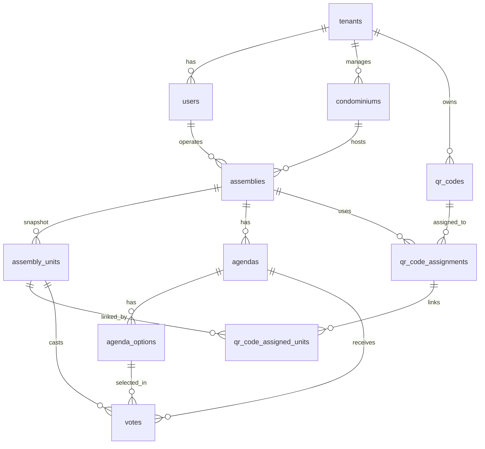

## 5. Database Schema & Models

### 5.1 Overview

O banco de dados utiliza **PostgreSQL 14+** com arquitetura multi-tenant baseada em `tenant_id`. O schema foi projetado para:

- **Isolamento total** entre administradoras (tenants)
- **Imutabilidade** de dados históricos (assemblies e votos)
- **Integridade referencial** estrita com constraints
- **Performance** otimizada com índices estratégicos
- **Auditabilidade** com timestamps e soft deletes seletivos

**Total de tabelas:** 10 tabelas principais

**Conceitos-chave:**
- **Snapshot Pattern:** Assembly units são cópia imutável (não refletem mudanças posteriores)
- **Soft Delete e Status:** QR codes usam soft delete + status; users/condominiums/assemblies usam status
- **Vote Immutability:** Votos nunca são deletados, apenas invalidados com flag

---

### 5.2 Diagrama de Relacionamentos (ER)



---

### 5.3 Enums e Tipos Customizados

Definir como `VARCHAR` com validação em application layer (Pydantic) e constraints CHECK no banco:

```sql
-- Assembly Type
CREATE TYPE assembly_type AS ENUM ('ordinary', 'extraordinary');

-- Assembly Status
CREATE TYPE assembly_status AS ENUM ('draft', 'in_progress', 'finished', 'cancelled');

-- Agenda Status  
CREATE TYPE agenda_status AS ENUM ('pending', 'open', 'closed', 'cancelled');

-- User Role
CREATE TYPE user_role AS ENUM ('property_manager', 'assembly_operator');

-- User Status
CREATE TYPE user_status AS ENUM ('active', 'inactive');

-- Condominium Status
CREATE TYPE condominium_status AS ENUM ('active', 'inactive');

-- QR Code Status
CREATE TYPE qr_code_status AS ENUM ('active', 'inactive');
```

**Nota:** Alternativamente, pode-se usar `VARCHAR` com `CHECK` constraints se preferir flexibilidade para adicionar novos valores sem migrations complexas.

---

### 5.4 Snapshot Pattern - Conceito e Importância

**Problema:** Se um condômino vende sua unidade após a assembleia, os dados históricos não podem mudar.

**Solução:** Tabela `assembly_units` armazena **snapshot imutável** dos dados no momento da importação do CSV.

**Características:**
- ✅ **Imutável:** Nunca sofre UPDATE ou DELETE
- ✅ **Histórico confiável:** Relatórios sempre mostram mesmos dados
- ✅ **Independente:** Mudanças no cadastro do condomínio não afetam assembleias antigas
- ✅ **Auditável:** Preserva estado exato de cada assembleia

**Fluxo:**
```
1. Admin importa CSV → cria registros em assembly_units
2. Assembleia acontece → votos referenciam assembly_units.id
3. Tempo passa, proprietário muda → assembly_units permanece igual
4. Relatório gerado 1 ano depois → mostra dados originais corretamente
```

---

### 5.5 Estratégia de Multi-Tenancy

**Padrão:** Row-Level Security com `tenant_id` em todas as tabelas principais.

**Tabelas com tenant_id:**
- `users`
- `condominiums`
- `assemblies` (herdado do condominium)
- `qr_codes`

**Tabelas sem tenant_id (herdam via FK):**
- `assembly_units` → herda de `assemblies`
- `agendas` → herda de `assemblies`
- `votes` → herda de `agendas`

**Implementação (Backend):**

```python
# Dependency para extrair tenant_id do JWT
async def get_current_tenant(
    token: str = Depends(oauth2_scheme)
) -> int:
    payload = jwt.decode(token, SECRET_KEY, algorithms=[ALGORITHM])
    return payload["tenant_id"]

# Uso em rotas
@router.get("/condominiums")
async def list_condominiums(
    db: Session = Depends(get_db),
    tenant_id: int = Depends(get_current_tenant)
):
    return db.query(Condominium)\
        .filter(Condominium.tenant_id == tenant_id)\
        .all()
```

**Queries sempre filtram por tenant_id:**
```sql
-- Exemplo: buscar assembleias
SELECT * FROM assemblies a
JOIN condominiums c ON a.condominium_id = c.id
WHERE c.tenant_id = :tenant_id;
```

**Segurança:** É **impossível** acessar dados de outro tenant sem comprometer o JWT.

---

### 5.6 Tabelas Detalhadas

#### 5.6.1 Tabela: `tenants`

**Propósito:** Representa administradoras de condomínio (clientes do sistema).

```sql
CREATE TABLE tenants (
    id SERIAL PRIMARY KEY,
    name VARCHAR(255) NOT NULL,
    email VARCHAR(255) NOT NULL UNIQUE,
    password_hash VARCHAR(255) NOT NULL,
    created_at TIMESTAMP DEFAULT CURRENT_TIMESTAMP,
    updated_at TIMESTAMP DEFAULT CURRENT_TIMESTAMP,
    
    -- Constraints
    CONSTRAINT chk_tenant_email CHECK (email ~* '^[A-Za-z0-9._%+-]+@[A-Za-z0-9.-]+\.[A-Za-z]{2,}$')
);

-- Índices
CREATE UNIQUE INDEX idx_tenants_email ON tenants(email);
CREATE INDEX idx_tenants_created ON tenants(created_at DESC);

-- Comentários
COMMENT ON TABLE tenants IS 'Administradoras de condomínio (clientes do sistema)';
COMMENT ON COLUMN tenants.password_hash IS 'Senha hash com bcrypt';
```

---

#### 5.6.2 Tabela: `users`

**Propósito:** Operadores de assembleia (funcionários da administradora).

```sql
CREATE TABLE users (
    id SERIAL PRIMARY KEY,
    tenant_id INTEGER NOT NULL REFERENCES tenants(id) ON DELETE CASCADE,
    name VARCHAR(255) NOT NULL,
    email VARCHAR(255) NOT NULL UNIQUE,
    password_hash VARCHAR(255) NOT NULL,
    role user_role NOT NULL DEFAULT 'assembly_operator',
    status user_status NOT NULL DEFAULT 'active',
    created_at TIMESTAMP DEFAULT CURRENT_TIMESTAMP,
    updated_at TIMESTAMP DEFAULT CURRENT_TIMESTAMP,
    deleted_at TIMESTAMP NULL,
    
    -- Constraints
    CONSTRAINT chk_user_email CHECK (email ~* '^[A-Za-z0-9._%+-]+@[A-Za-z0-9.-]+\.[A-Za-z]{2,}$')
);

-- Índices
CREATE INDEX idx_users_tenant ON users(tenant_id);
CREATE UNIQUE INDEX idx_users_email ON users(email) WHERE deleted_at IS NULL;
CREATE INDEX idx_users_deleted ON users(deleted_at) WHERE deleted_at IS NOT NULL;

-- Comentários
COMMENT ON TABLE users IS 'Operadores de assembleia (funcionários das administradoras)';
COMMENT ON COLUMN users.status IS 'active ou inactive (login bloqueado quando inactive)';
COMMENT ON COLUMN users.deleted_at IS 'Reservado para exclusao hard/legacy';
COMMENT ON COLUMN users.role IS 'property_manager (admin) ou assembly_operator';
```

---

#### 5.6.3 Tabela: `condominiums`

**Propósito:** Condomínios gerenciados pela administradora.

```sql
CREATE TABLE condominiums (
    id SERIAL PRIMARY KEY,
    tenant_id INTEGER NOT NULL REFERENCES tenants(id) ON DELETE CASCADE,
    name VARCHAR(255) NOT NULL,
    address TEXT NOT NULL,
    status condominium_status NOT NULL DEFAULT 'active',
    created_at TIMESTAMP DEFAULT CURRENT_TIMESTAMP,
    updated_at TIMESTAMP DEFAULT CURRENT_TIMESTAMP
);

-- Índices
CREATE INDEX idx_condominiums_tenant ON condominiums(tenant_id);
CREATE INDEX idx_condominiums_name ON condominiums(name);

-- Comentários
COMMENT ON TABLE condominiums IS 'Condomínios gerenciados pelas administradoras';
COMMENT ON COLUMN condominiums.status IS 'active ou inactive (sem novas assembleias quando inactive)';
```

---

#### 5.6.4 Tabela: `assemblies`

**Propósito:** Assembleias realizadas nos condomínios.

```sql
CREATE TABLE assemblies (
    id SERIAL PRIMARY KEY,
    condominium_id INTEGER NOT NULL REFERENCES condominiums(id) ON DELETE RESTRICT,
    operator_id INTEGER NULL REFERENCES users(id) ON DELETE SET NULL,
    title VARCHAR(255) NOT NULL,
    assembly_date TIMESTAMP NOT NULL,
    location TEXT NOT NULL,
    assembly_type assembly_type NOT NULL,
    status assembly_status NOT NULL DEFAULT 'draft',
    created_at TIMESTAMP DEFAULT CURRENT_TIMESTAMP,
    updated_at TIMESTAMP DEFAULT CURRENT_TIMESTAMP,
    
    -- Constraints
    CONSTRAINT chk_assembly_date CHECK (assembly_date >= created_at)
);

-- Índices
CREATE INDEX idx_assemblies_condominium ON assemblies(condominium_id);
CREATE INDEX idx_assemblies_operator ON assemblies(operator_id);
CREATE INDEX idx_assemblies_date ON assemblies(assembly_date DESC);
CREATE INDEX idx_assemblies_status ON assemblies(status);

-- Índice composto para queries comuns (assemblies futuras de um tenant)
CREATE INDEX idx_assemblies_condo_date ON assemblies(condominium_id, assembly_date DESC);

-- Comentários
COMMENT ON TABLE assemblies IS 'Assembleias de condomínio';
COMMENT ON COLUMN assemblies.operator_id IS 'Operador responsável - NULL = admin opera';
COMMENT ON COLUMN assemblies.status IS 'draft, in_progress, finished ou cancelled';
```

---

#### 5.6.5 Tabela: `assembly_units`

**Propósito:** Snapshot imutável das unidades no momento da assembleia.

```sql
CREATE TABLE assembly_units (
    id SERIAL PRIMARY KEY,
    assembly_id INTEGER NOT NULL REFERENCES assemblies(id) ON DELETE CASCADE,
    unit_number VARCHAR(50) NOT NULL,
    owner_name VARCHAR(255) NOT NULL,
    ideal_fraction NUMERIC(5,2) NOT NULL,
    cpf_cnpj VARCHAR(18) NOT NULL,
    created_at TIMESTAMP DEFAULT CURRENT_TIMESTAMP,
    
    -- Constraints
    CONSTRAINT chk_unit_ideal_fraction CHECK (ideal_fraction > 0 AND ideal_fraction <= 100),
    CONSTRAINT uq_assembly_unit_number UNIQUE(assembly_id, unit_number)
);

-- Índices
CREATE INDEX idx_assembly_units_assembly ON assembly_units(assembly_id);
CREATE INDEX idx_assembly_units_owner ON assembly_units(owner_name);

-- Comentários
COMMENT ON TABLE assembly_units IS 'Snapshot IMUTÁVEL das unidades (importado do CSV)';
COMMENT ON COLUMN assembly_units.ideal_fraction IS 'Fração ideal em % (ex: 2.5 = 2.5%)';
COMMENT ON COLUMN assembly_units.cpf_cnpj IS 'CPF (999.999.999-99) ou CNPJ (99.999.999/9999-99)';
```

**⚠️ IMPORTANTE:** Esta tabela **NUNCA** sofre UPDATE ou DELETE. É snapshot histórico.

---

#### 5.6.6 Tabela: `agendas`

**Propósito:** Pautas (itens) a serem votados na assembleia.

```sql
CREATE TABLE agendas (
    id SERIAL PRIMARY KEY,
    assembly_id INTEGER NOT NULL REFERENCES assemblies(id) ON DELETE CASCADE,
    title VARCHAR(255) NOT NULL,
    description TEXT,
    display_order INTEGER NOT NULL DEFAULT 0,
    status agenda_status NOT NULL DEFAULT 'pending',
    opened_at TIMESTAMP NULL,
    closed_at TIMESTAMP NULL,
    created_at TIMESTAMP DEFAULT CURRENT_TIMESTAMP,
    updated_at TIMESTAMP DEFAULT CURRENT_TIMESTAMP,
    
    -- Constraints
    CONSTRAINT chk_agenda_order UNIQUE(assembly_id, display_order),
    CONSTRAINT chk_agenda_dates CHECK (
        (status = 'open' AND opened_at IS NOT NULL) OR
        (status != 'open') AND
        (closed_at IS NULL OR closed_at >= opened_at)
    )
);

-- Índices
CREATE INDEX idx_agendas_assembly ON agendas(assembly_id);
CREATE INDEX idx_agendas_status ON agendas(status);
CREATE INDEX idx_agendas_order ON agendas(assembly_id, display_order);

-- Comentários
COMMENT ON TABLE agendas IS 'Pautas (itens de votação) da assembleia';
COMMENT ON COLUMN agendas.display_order IS 'Ordem de exibição (pode ser reorganizada)';
COMMENT ON COLUMN agendas.status IS 'pending, open, closed ou cancelled';
```

---

#### 5.6.7 Tabela: `agenda_options`

**Propósito:** Opções de voto para cada pauta.

```sql
CREATE TABLE agenda_options (
    id SERIAL PRIMARY KEY,
    agenda_id INTEGER NOT NULL REFERENCES agendas(id) ON DELETE CASCADE,
    option_text VARCHAR(255) NOT NULL,
    display_order INTEGER NOT NULL DEFAULT 0,
    created_at TIMESTAMP DEFAULT CURRENT_TIMESTAMP,
    
    -- Constraints
    CONSTRAINT uq_agenda_option_order UNIQUE(agenda_id, display_order)
);

-- Índices
CREATE INDEX idx_agenda_options_agenda ON agenda_options(agenda_id);
CREATE INDEX idx_agenda_options_order ON agenda_options(agenda_id, display_order);

-- Comentários
COMMENT ON TABLE agenda_options IS 'Opções de voto para cada pauta (ex: Sim, Não, Abstenção)';
```

---

#### 5.6.8 Tabela: `qr_codes`

**Propósito:** QR Codes reutilizáveis para votação.

```sql
CREATE TABLE qr_codes (
    id SERIAL PRIMARY KEY,
    tenant_id INTEGER NOT NULL REFERENCES tenants(id) ON DELETE CASCADE,
    token UUID NOT NULL UNIQUE DEFAULT gen_random_uuid(),
    visual_number INTEGER NOT NULL,
    status qr_code_status NOT NULL DEFAULT 'active',
    created_at TIMESTAMP DEFAULT CURRENT_TIMESTAMP,
    deleted_at TIMESTAMP NULL,
    
    -- Constraints
    CONSTRAINT uq_tenant_visual_number UNIQUE(tenant_id, visual_number)
);

-- Índices
CREATE UNIQUE INDEX idx_qr_codes_token ON qr_codes(token);
CREATE INDEX idx_qr_codes_tenant ON qr_codes(tenant_id);
CREATE INDEX idx_qr_codes_visual ON qr_codes(tenant_id, visual_number);
CREATE INDEX idx_qr_codes_active ON qr_codes(tenant_id) WHERE deleted_at IS NULL;

-- Comentários
COMMENT ON TABLE qr_codes IS 'QR Codes reutilizáveis (pertencem à administradora)';
COMMENT ON COLUMN qr_codes.token IS 'UUID v4 único e imprevisível para segurança';
COMMENT ON COLUMN qr_codes.visual_number IS 'Número sequencial impresso no cartão (ex: 001, 002)';
COMMENT ON COLUMN qr_codes.status IS 'active ou inactive';
COMMENT ON COLUMN qr_codes.deleted_at IS 'Soft delete - permite reativar QR code';
```

---

#### 5.6.9 Tabela: `qr_code_assignments`

**Propósito:** Vinculação de QR Code a unidades (check-in).

```sql
CREATE TABLE qr_code_assignments (
    id SERIAL PRIMARY KEY,
    assembly_id INTEGER NOT NULL REFERENCES assemblies(id) ON DELETE CASCADE,
    qr_code_id INTEGER NOT NULL REFERENCES qr_codes(id) ON DELETE RESTRICT,
    is_proxy BOOLEAN NOT NULL DEFAULT FALSE,
    assigned_at TIMESTAMP DEFAULT CURRENT_TIMESTAMP,
    assigned_by INTEGER NOT NULL REFERENCES users(id) ON DELETE RESTRICT,
    
    -- Constraints
    CONSTRAINT uq_qr_per_assembly UNIQUE(assembly_id, qr_code_id)
);

-- Índices
CREATE INDEX idx_qr_assignments_assembly ON qr_code_assignments(assembly_id);
CREATE INDEX idx_qr_assignments_qr ON qr_code_assignments(qr_code_id);
CREATE INDEX idx_qr_assignments_assigned_by ON qr_code_assignments(assigned_by);

-- Comentários
COMMENT ON TABLE qr_code_assignments IS 'Check-in: vinculação de QR code a unidades';
COMMENT ON COLUMN qr_code_assignments.is_proxy IS 'TRUE se for procuração (representa outros)';
COMMENT ON COLUMN qr_code_assignments.assigned_by IS 'Operador que fez o check-in';
```

---

#### 5.6.10 Tabela: `qr_code_assigned_units`

**Propósito:** Relação many-to-many entre assignment e unidades (um QR pode representar múltiplas unidades).

```sql
CREATE TABLE qr_code_assigned_units (
    id SERIAL PRIMARY KEY,
    assignment_id INTEGER NOT NULL REFERENCES qr_code_assignments(id) ON DELETE CASCADE,
    assembly_unit_id INTEGER NOT NULL REFERENCES assembly_units(id) ON DELETE CASCADE,
    created_at TIMESTAMP DEFAULT CURRENT_TIMESTAMP,
    
    -- Constraints
    CONSTRAINT uq_assignment_unit UNIQUE(assignment_id, assembly_unit_id)
);

-- Índices
CREATE INDEX idx_qr_assigned_units_assignment ON qr_code_assigned_units(assignment_id);
CREATE INDEX idx_qr_assigned_units_unit ON qr_code_assigned_units(assembly_unit_id);

-- Comentários
COMMENT ON TABLE qr_code_assigned_units IS 'Many-to-many: QR code representa múltiplas unidades';
```

---

#### 5.6.11 Tabela: `votes`

**Propósito:** Votos registrados nas pautas.

```sql
CREATE TABLE votes (
    id SERIAL PRIMARY KEY,
    agenda_id INTEGER NOT NULL REFERENCES agendas(id) ON DELETE RESTRICT,
    assembly_unit_id INTEGER NOT NULL REFERENCES assembly_units(id) ON DELETE RESTRICT,
    option_id INTEGER NOT NULL REFERENCES agenda_options(id) ON DELETE RESTRICT,
    is_valid BOOLEAN NOT NULL DEFAULT TRUE,
    invalidated_at TIMESTAMP NULL,
    invalidated_by INTEGER NULL REFERENCES users(id) ON DELETE SET NULL,
    created_at TIMESTAMP DEFAULT CURRENT_TIMESTAMP,
    
    -- Constraints: garante voto único por unidade/pauta
    CONSTRAINT uq_vote_per_unit_agenda UNIQUE(agenda_id, assembly_unit_id),
    CONSTRAINT chk_invalidation CHECK (
        (is_valid = TRUE AND invalidated_at IS NULL AND invalidated_by IS NULL) OR
        (is_valid = FALSE AND invalidated_at IS NOT NULL AND invalidated_by IS NOT NULL)
    )
);

-- Índices
CREATE INDEX idx_votes_agenda ON votes(agenda_id);
CREATE INDEX idx_votes_unit ON votes(assembly_unit_id);
CREATE INDEX idx_votes_option ON votes(option_id);
CREATE INDEX idx_votes_valid ON votes(agenda_id, is_valid) WHERE is_valid = TRUE;

-- Comentários
COMMENT ON TABLE votes IS 'Votos registrados (IMUTÁVEIS - invalidar, não deletar)';
COMMENT ON COLUMN votes.is_valid IS 'FALSE se operador invalidou o voto (permite revotar)';
COMMENT ON COLUMN votes.invalidated_by IS 'Operador que invalidou (para auditoria)';
```

**⚠️ IMPORTANTE:** Votos **NUNCA** são deletados. Use `is_valid = FALSE` para invalidar.

---

### 5.7 Convenções de Nomenclatura

**Padrão seguido em todo o schema:**

| Elemento | Convenção | Exemplo |
|----------|-----------|---------|
| Tabelas | `snake_case` plural | `assembly_units`, `qr_codes` |
| Colunas | `snake_case` | `ideal_fraction`, `created_at` |
| PKs | `id` (SERIAL) | `id` |
| FKs | `{tabela}_id` | `tenant_id`, `assembly_id` |
| Constraints | `{tipo}_{descricao}` | `uq_vote_per_unit_agenda` |
| Índices | `idx_{tabela}_{colunas}` | `idx_votes_agenda` |
| Enums | `{nome}_type/status` | `assembly_type`, `user_role` |

**Tipos de Constraints:**
- `pk_` = Primary Key
- `fk_` = Foreign Key
- `uq_` = Unique
- `chk_` = Check

---

### 5.8 Campos de Auditoria Padrão

**Aplicado em todas as tabelas principais:**

```sql
created_at TIMESTAMP DEFAULT CURRENT_TIMESTAMP,
updated_at TIMESTAMP DEFAULT CURRENT_TIMESTAMP
```

**Soft Delete e Status:**
```sql
deleted_at TIMESTAMP NULL
```
```sql
status user_status NOT NULL DEFAULT 'active'
status condominium_status NOT NULL DEFAULT 'active'
status assembly_status NOT NULL DEFAULT 'draft'
status qr_code_status NOT NULL DEFAULT 'active'
```

**Trigger para atualizar `updated_at` automaticamente:**
```sql
CREATE OR REPLACE FUNCTION update_updated_at_column()
RETURNS TRIGGER AS $$
BEGIN
    NEW.updated_at = CURRENT_TIMESTAMP;
    RETURN NEW;
END;
$$ LANGUAGE plpgsql;

-- Aplicar em cada tabela
CREATE TRIGGER update_users_updated_at
    BEFORE UPDATE ON users
    FOR EACH ROW
    EXECUTE FUNCTION update_updated_at_column();
```

---

### 5.9 Índices Críticos para Performance

**Índices obrigatórios (já incluídos nas tabelas acima):**

1. **Tenant Isolation:** Todas tabelas com `tenant_id` têm índice
   ```sql
   CREATE INDEX idx_{table}_tenant ON {table}(tenant_id);
   ```

2. **Foreign Keys:** Todas FKs têm índice (performance em JOINs)
   ```sql
   CREATE INDEX idx_assemblies_condominium ON assemblies(condominium_id);
   ```

3. **Queries Comuns:** Índices compostos para queries frequentes
   ```sql
   CREATE INDEX idx_assemblies_condo_date ON assemblies(condominium_id, assembly_date DESC);
   CREATE INDEX idx_votes_valid ON votes(agenda_id, is_valid) WHERE is_valid = TRUE;
   ```

4. **Soft Deletes/Status:** Índices parciais em `deleted_at` e filtros por status
   ```sql
   CREATE INDEX idx_users_active ON users(tenant_id) WHERE deleted_at IS NULL;
   ```

**Impacto:** Queries de listagem ~10x mais rápidas com índices corretos.

---

### 5.10 Strategy de Migrations com Alembic

**Workflow:**

1. **Criar models SQLAlchemy** (em `app/features/{feature}/models.py`)
2. **Auto-gerar migration:**
   ```bash
   alembic revision --autogenerate -m "create assemblies table"
   ```
3. **Revisar migration gerada** (sempre validar antes de aplicar)
4. **Aplicar migration:**
   ```bash
   alembic upgrade head
   ```

**Exemplo de Migration File:**

```python
# alembic/versions/001_create_tenants.py
"""create tenants table

Revision ID: 001
Revises: 
Create Date: 2026-01-19 10:00:00.000000
"""
from alembic import op
import sqlalchemy as sa

# revision identifiers
revision = '001'
down_revision = None
branch_labels = None
depends_on = None

def upgrade():
    op.create_table(
        'tenants',
        sa.Column('id', sa.Integer(), nullable=False),
        sa.Column('name', sa.String(255), nullable=False),
        sa.Column('email', sa.String(255), nullable=False),
        sa.Column('password_hash', sa.String(255), nullable=False),
        sa.Column('created_at', sa.TIMESTAMP(), server_default=sa.text('CURRENT_TIMESTAMP')),
        sa.Column('updated_at', sa.TIMESTAMP(), server_default=sa.text('CURRENT_TIMESTAMP')),
        sa.PrimaryKeyConstraint('id'),
        sa.UniqueConstraint('email')
    )
    op.create_index('idx_tenants_email', 'tenants', ['email'], unique=True)

def downgrade():
    op.drop_index('idx_tenants_email', table_name='tenants')
    op.drop_table('tenants')
```

**Comandos úteis:**
```bash
# Ver histórico
alembic history

# Rollback última migration
alembic downgrade -1

# Ir para versão específica
alembic upgrade 001

# Ver SQL sem aplicar
alembic upgrade head --sql
```

---

### 5.11 Seed Data (Estrutura Mínima)

**Script SQL para ambiente de desenvolvimento:**

```sql
-- 1. Criar tenant de exemplo
INSERT INTO tenants (name, email, password_hash) VALUES
('Administradora Demo', 'admin@demo.com', '$2b$12$LQv3c1yqBWVHxkd0LHAkCOYz6TtxMQJqhN8/LewY5GyYILWTCi3wi');
-- Senha: demo123

-- 2. Criar usuário admin (property_manager)
INSERT INTO users (tenant_id, name, email, password_hash, role) VALUES
(1, 'Admin Demo', 'admin@demo.com', '$2b$12$LQv3c1yqBWVHxkd0LHAkCOYz6TtxMQJqhN8/LewY5GyYILWTCi3wi', 'property_manager');

-- 3. Criar condomínio vazio
INSERT INTO condominiums (tenant_id, name, address) VALUES
(1, 'Condomínio Exemplo', 'Rua Exemplo, 123 - São Paulo, SP');

-- 4. Criar alguns QR codes para teste
INSERT INTO qr_codes (tenant_id, token, visual_number) VALUES
(1, gen_random_uuid(), 1),
(1, gen_random_uuid(), 2),
(1, gen_random_uuid(), 3),
(1, gen_random_uuid(), 4),
(1, gen_random_uuid(), 5);
```

**Arquivo:** `alembic/seeds/001_demo_data.sql`

**Executar:**
```bash
psql $DATABASE_URL -f alembic/seeds/001_demo_data.sql
```

---

### 5.12 Integridade Referencial (CASCADE vs RESTRICT)

**Estratégia aplicada:**

| Relação | ON DELETE | Justificativa |
|---------|-----------|---------------|
| `tenant → users` | **CASCADE** | Deletar tenant remove todos operadores |
| `tenant → condominiums` | **CASCADE** | Deletar tenant remove todos condos |
| `tenant → qr_codes` | **CASCADE** | QR codes pertencem ao tenant |
| `condominium → assemblies` | **RESTRICT** | Não pode deletar condo com assembleias |
| `assembly → units/agendas` | **CASCADE** | Deletar assembly limpa tudo relacionado |
| `agenda → votes` | **RESTRICT** | Protege votos (dados críticos) |
| `assembly_unit → votes` | **RESTRICT** | Protege votos (dados críticos) |
| `user → assemblies` | **SET NULL** | Operador deletado, assembly permanece |

**⚠️ IMPORTANTE:** Votos são **super protegidos**. RESTRICT impede deleção acidental de dados críticos.

---

### 5.13 Constraints de Validação Importantes

**Validações implementadas no schema:**

```sql
-- 1. Email válido
CONSTRAINT chk_tenant_email CHECK (
    email ~* '^[A-Za-z0-9._%+-]+@[A-Za-z0-9.-]+\.[A-Za-z]{2,}$'
)

-- 2. Fração ideal entre 0 e 100%
CONSTRAINT chk_unit_ideal_fraction CHECK (
    ideal_fraction > 0 AND ideal_fraction <= 100
)

-- 3. Data da assembleia não pode ser no passado (vs created_at)
CONSTRAINT chk_assembly_date CHECK (
    assembly_date >= created_at
)

-- 4. Pauta só pode fechar após abrir
CONSTRAINT chk_agenda_dates CHECK (
    closed_at IS NULL OR closed_at >= opened_at
)

-- 5. Voto inválido precisa ter invalidated_at e invalidated_by
CONSTRAINT chk_invalidation CHECK (
    (is_valid = TRUE AND invalidated_at IS NULL) OR
    (is_valid = FALSE AND invalidated_at IS NOT NULL)
)

-- 6. Unidade só pode votar 1x por pauta
CONSTRAINT uq_vote_per_unit_agenda UNIQUE(agenda_id, assembly_unit_id)
```

**Nota:** Validações complexas (ex: soma de frações = 100%) são feitas em application layer.

---

### 5.14 Sequência de Criação (Ordem de Dependências)

**Ordem correta para evitar erros de FK:**

```sql
-- 1. Criar enums primeiro
CREATE TYPE assembly_type AS ENUM (...);
CREATE TYPE assembly_status AS ENUM (...);
CREATE TYPE agenda_status AS ENUM (...);
CREATE TYPE user_role AS ENUM (...);

-- 2. Tabelas sem dependências
CREATE TABLE tenants (...);

-- 3. Tabelas que dependem de tenants
CREATE TABLE users (...);
CREATE TABLE condominiums (...);
CREATE TABLE qr_codes (...);

-- 4. Tabelas que dependem de condominiums
CREATE TABLE assemblies (...);

-- 5. Tabelas que dependem de assemblies
CREATE TABLE assembly_units (...);
CREATE TABLE agendas (...);
CREATE TABLE qr_code_assignments (...);

-- 6. Tabelas que dependem de agendas
CREATE TABLE agenda_options (...);

-- 7. Tabelas finais (dependem de múltiplas)
CREATE TABLE votes (...);
CREATE TABLE qr_code_assigned_units (...);

-- 8. Triggers (após todas as tabelas)
CREATE TRIGGER update_users_updated_at ...
```

**Script completo:** `alembic/versions/001_initial_schema.py` (gerado por Alembic)

---
